# Exercise 1 - Get started: Development environment and Hello World

First things first, you need to set up your development environment and check that everything is running smoothly.

For this exercise, we'll use SAP Web IDE as the development tool of choice. This version of SAP Web IDE is not what you're used to. It's a completely new version that provides a web-based Visual Studio Code-like experience. So it's like VS Code, but for your browser.  What's great about using SAP Web IDE? You get an editor, useful extensions and all the tools required to develop CAP applications and full access to the terminal.

To make sure everything is set up correctly, this exercise also includes how to build & run a simple Hello World application. CAP supports both Java and Node.js development. But for this exercise, we'll be using Java. The CAP Java stack is able to tightly integrate with Spring Boot, which provides a lot of features out of the box. This means, Spring Boot will be your runtime container.

## Open SAP Web IDE and create your Dev Space

Before you can start using SAP Web IDE, you need to create your developer space, where your project will run. Depending on the application you want to develop, you can create different dev spaces. For this hands-on session, you'll create a dev space personalized for building services and applications with CAP.

1. Go to the URL for SAP Web IDE given by the instructor.

2. Choose **Create Dev Space**.

    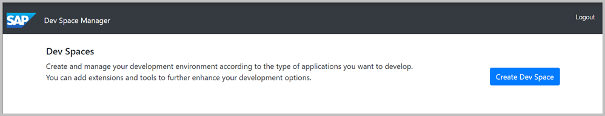

3. Choose a name for your dev space. For example **TechEd19_XXX**. **XXX** is the number given to you by your instructor.

4. Choose **SAP Cloud Business Application** as the application type.

    By selecting **SAP Cloud Business Application**, your space comes with several extensions out of the box that you'll need to develop CAP applications.  For example, CDS tools are built in. This saves unnecessary setup time.

5. Choose **Create Dev Space**.

    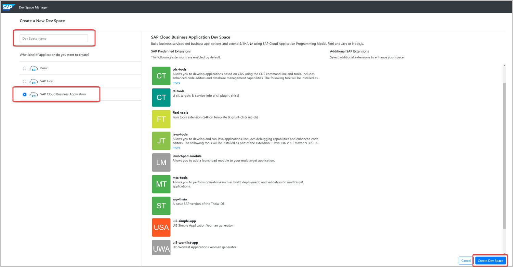

    The creation of the dev space takes a few seconds. When it's ready, you can open your dev space by clicking on the name.

    

## Initialize the application

1. In SAP Web IDE, choose **Open Workspace**:

    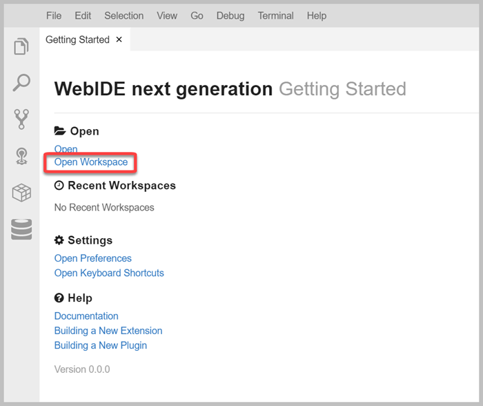

    Make sure **Projects** is selected form the drop-down menu and choose **Open**.

    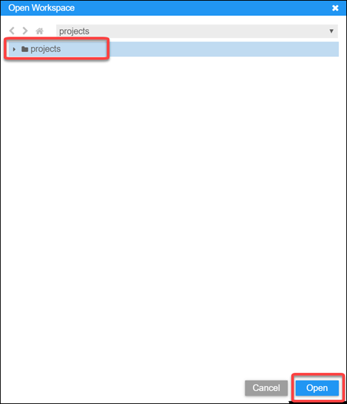

2. From the main menu, choose **Terminal, New Terminal**.

    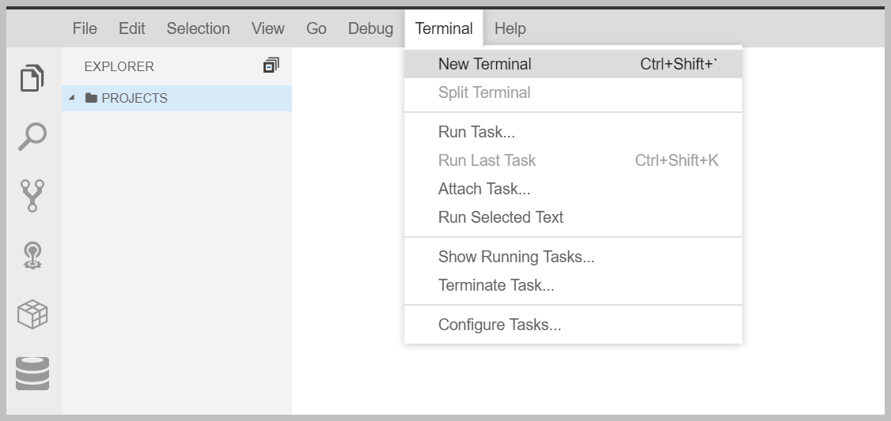

3. From the terminal run:

    ```bash
    mvn -B archetype:generate -DarchetypeArtifactId=cds-services-archetype -DarchetypeGroupId=com.sap.cds -DarchetypeVersion=1.0.0-1935 \
    -DgroupId=com.sap.teched.cap -DartifactId=products-service -Dpackage=com.sap.teched.cap.productsservice
    ```

    This will initialize the application and create your project as follows:

    - The project is named `products-service`. You will also reuse it in [Exercise 2](../exercise2/README.md).
    - The `db` folder stores database related artifacts.
    - The `srv` folder stores your Java application.

4. The project you just created contains some sample data. Since part of this exercise is showing you how to add your own data, we need to delete the sample data.

    a. Go to the **products_service** folder and expand the **db** folder.

    b. Right-click on the `data-model.cds` file and choose **Delete** from the context menu.

      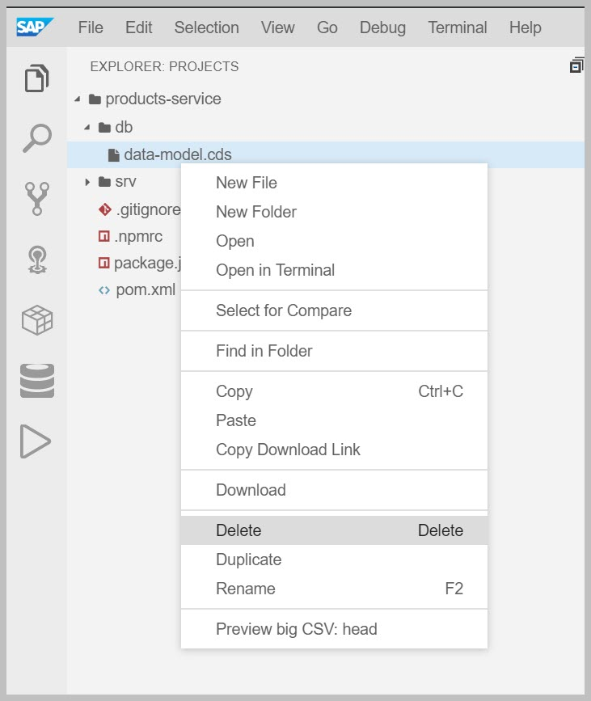

    c. Expand the **srv** folder and delete the `cat-service.cds`file.

## Define a service

CAP applications use CDS (Core Data Services) to:
- describe data structures by using Entity definitions
- describe how data structures are consumed by using Service definitions

In this step, you'll define a simple service, which also defines it's own entity. In more complex applications, services usually expose projections on entities defined in the data model. You will see this later in [Exercise 2](../exercise2/README.md).

1. Right-click on the `srv` folder, choose **New File** and name it `admin-service.cds`

    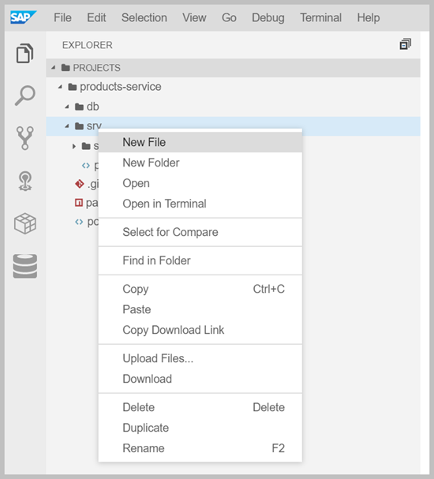

2. Choose **OK** to create the file.

    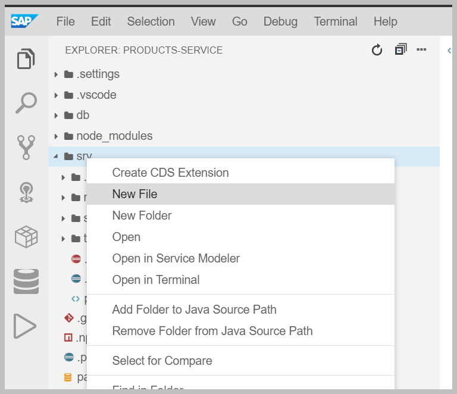

3. Add the following service defintion to the file:

    ```swift
    service AdminService {
        entity Products {
            key ID : Integer;
            title : String(111);
            descr : String(1111);
        }
    }
    ```

4. Go to the root of your **products-service** project by running `cd ~/projects/products-service` within the terminal. After that run `mvn clean install` to compile the model definition. Note that running this for the first time in a fresh dev space might take a while, depending on the network.

    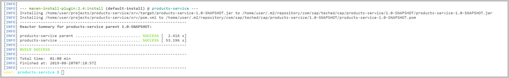

    After running this command, some files are generated and added to the `srv/src/main/resources/edmx` folder. This is the default path, where CAP Java runtime looks for the model definitions.

    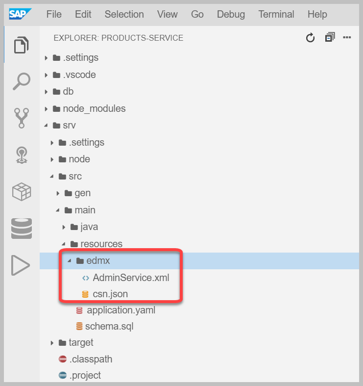

## Run your application

While initializing the application an `Application.java` file was created, which contains a `main` method. The `Application.java` is the startup class for the Spring Boot container.

Take a look at the `Application.java` in the `com.sap.teched.cap.productsservice` package (file path: `srv/src/main/java/com/sap/teched/cap/productsservice`).

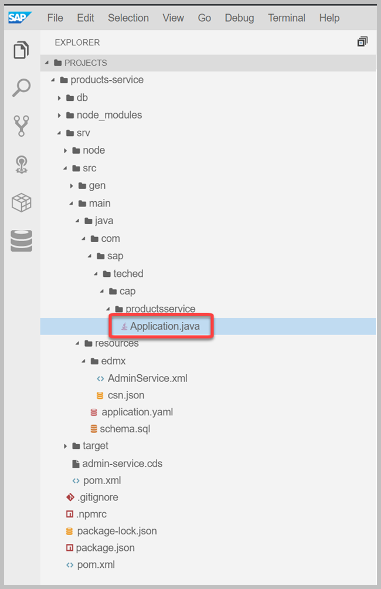

As you can see, the file does not contain CAP specific startup instructions. It is the typical boilerplate code found in every Spring Boot application.

The initialization of the CAP Java runtime is done by Spring automatically, based on the dependencies defined in the `pom.xml`.

1. To start the application, go to the root of your project (`cd ~/projects/products-service`) in the terminal and run `mvn spring-boot:run`

2. A notifaction tab saying "A service is listenning to port 8080" will appear.

    a. Choose `Expose and Open` and provide `app-port` as the unique description.

      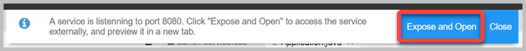

    b. Press `Enter`and the application opens in a new tab.

    **Hint**: In case you missed the notification tab "A service is listenning to port 8080", you can reopen it:

    1. Go to **View** --> **Find Command** --> **Ports: Expose**.

    2. Select or enter `8080` and provide `app-port` as the unique description.

    You can also use the Command Palette ports command to preview, unexpose and rename ports.

4. Add `/odata/v4/AdminService/$metadata` to your app URL to inspect the OData metadata, which is automatically served by the CAP Java runtime.

    "<APP_URL>" is the URL created when you run your application. When you first open it in a new tab, you'll see a welcome page. After adding `/odata/v4/AdminService/$metadata`, you'll see the OData metadata.

    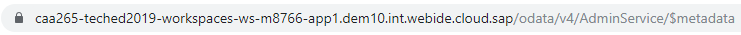

In the next step, you'll learn how to add custom logic. Specifically, so that your application can read and create Products.

## Add a custom event handler

Later on in the session, you'll learn that CAP Java runtime can handle all CRUD events (create, read, update and delete) triggered by OData requests out of the box.

However for now, we'll show you how to do this manually, so that you can see how to easily write a custom event handler to extend the event handling process.

1. Create the Java package, by creating a new folder `handlers` under `srv/src/main/java/com/sap/teched/cap/productsservice`.

2. Create the Java class file `AdminService.java` in the created `handlers` folder, with the following content:

    ```Java
    package com.sap.teched.cap.productsservice.handlers;

    import java.util.HashMap;
    import java.util.Map;

    import org.springframework.stereotype.Component;

    import com.sap.cds.services.cds.CdsCreateEventContext;
    import com.sap.cds.services.cds.CdsReadEventContext;
    import com.sap.cds.services.cds.CdsService;
    import com.sap.cds.services.handler.EventHandler;
    import com.sap.cds.services.handler.annotations.On;
    import com.sap.cds.services.handler.annotations.ServiceName;

    @Component
    @ServiceName("AdminService")
    public class AdminService implements EventHandler {

        private Map<Object, Map<String, Object>> products = new HashMap<>();

        @On(event = CdsService.EVENT_CREATE, entity = "AdminService.Products")
        public void onCreate(CdsCreateEventContext context) {
            context.getCqn().entries().forEach(e -> products.put(e.get("ID"), e));
            context.setResult(context.getCqn().entries());
        }

        @On(event = CdsService.EVENT_READ, entity = "AdminService.Products")
        public void onRead(CdsReadEventContext context) {
            context.setResult(products.values());
        }

    }
    ```

    This class now handles the `READ` and `CREATE` events that target the `Products` entity of the `AdminService`.
    - The `READ` operation just returns all entities kept in memory.
    - The `CREATE` event extracts the payload from the CQN representation and stores it in memory.

    CQN (CDS Query Notation) is the common language in CAP to run queries against services. It can be used to talk to the services defined by your model, but also remote services, such as the database.

    The event handler uses the following APIs, which are available for Service Providers in CAP Java:

    * Event handler classes have to implement the marker interface `EventHandler` and register themselves as Spring Beans (`@Component`). The marker interface is important, because it enables the CAP Java runtime to identify these classes among all Spring Beans.
    * Event handler methods are registered with `@On`, `@Before` or `@After` annotations. Every event, such as an entity creation, runs through these three phases. Each phase has a slightly different semantic. You will learn more about these semantics in [Exercise 4](../exercise4/README.md).
    * The annotation `@ServiceName` specifies the default service name all event handler methods apply to. Here this is `AdminService`, as this was also the name when defining the service in the CDS model.
    * Event handler methods get an event-specific event context parameter, which provides access to the input parameters of the event and the ability to set the result. For example, let's look at the `CdsCreateEventContext context` parameter. The event we are extending is the `CREATE` event. The type of the context variable is specific to this extended `CREATE` event. The `onCreate` method returns `void`, as the result is set by running: `context.setResult(…)`.

3. Stop your application if it is still running in the terminal, by pressing `CTRL + C`.

4. Start your application again by running `mvn spring-boot:run` in the terminal.

   Choose **Open in a new tab** when prompted.

5. Try to insert some data. For example, use curl from a new terminal to run the following request.

   You can open terminals by choosing **Terminal, New Terminal** from the main menu.

    ```bash
    curl -X POST http://localhost:8080/odata/v4/AdminService/Products \
    -H "Content-Type: application/json" \
    -d '{"ID": 42, "title": "Awesome product", "descr": "It is really really awesome!"}'
    ```

6. To read the data again, open the following URL in your browser:

    `<APP_URL>/odata/v4/AdminService/Products`

    You should see something like this:

    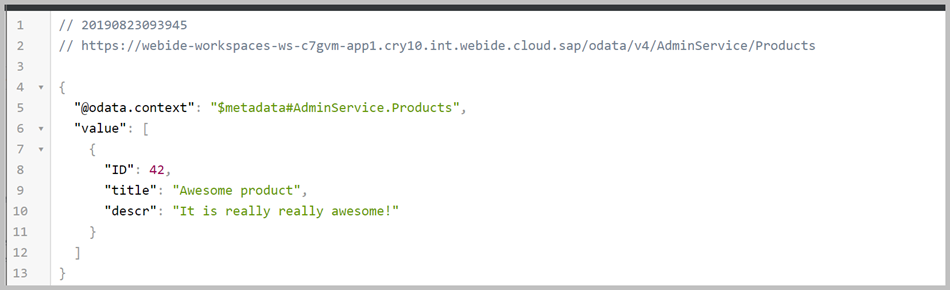

## Great job!

You have successfully developed a basic CAP Java application AND added custom logic to handle specific requests.
[Exercise 2](../exercise2/README.md) will show you how to extend the application and build the products service from scratch.
In addition, you will use an actual database as the persistence and see some of the features the CAP Java stack provides out of the box, without a single line of custom coding.
