# Exercise 3 - Building the Bookstore

Now that your products service is ready to be reused, you will build your bookstore application upon it. In this exercise you will create the model and the services of the bookstore application. 
After that you will initialize the SQLite database of your bookstore application with localized example data coming from CSV files. 
You will then run your application - still without any custom coding required - and see the localization features of CAP in action.

## Code Checkpoint

In case something went wrong in one of the previous exercises, or you want to start from a clean state you can checkout the following code checkpoint:

Run the following command to ensure your code is in sync with the checkpoint: `git checkout -f CAA160-ex2-final`

## Initialize the bookstore application

From the products service that you created in the previous exercise we just want to resuse the domain and service models.
For the bookstore, which you'll develop in this exercise we need to create and initialize a bookstore project first.

1. From the main menu of SAP Application Studio, choose **Terminal, New Terminal**.

2. Before adding the `bookstore` project, we need to make sure you are in the projects folder. Both projects (`products-service` and `bookstore`) should be placed next to each other. 

    Run `cd ~/projects` to go back to the projects folder. 

3. Now that you are in the correct folder, run the following command:

    ```bash
    mvn -B archetype:generate -DarchetypeArtifactId=cds-services-archetype -DarchetypeGroupId=com.sap.cds \
    -DarchetypeVersion=1.2.0 -DcdsVersion=3.21.2 \
    -DgroupId=com.sap.teched.cap -DartifactId=bookstore
    ```
4. To open the bookstore project in a new workspace:

    a. Go to **File, Open Workspace**
    
    b. Choose **bookstore** from the project list and then **Open**
    
      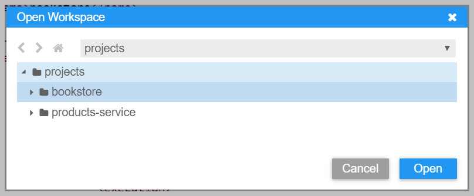
      
    > If you see a notification asking if you want to synchronize the Java classpath/configuration, choose **Always**.

## Reusing the products-service

As the product-service should be reused for the bookstore you need to add a dependency between those two projects.
Reusable models can be published as NPM modules and imported through dependencies in the `package.json` of a project.

First, we need to simulate a release of the product-service module, and consume this release in the bookstore application.
In the terminal run the following commands:

1. `cd ~/projects/bookstore`

2. `npm install $(npm pack ../products-service -s)`

3. `npm install && npm dedup`

If you open the `package.json` of your bookstore project, you'll see a dependency to `@sap/capire-products`.

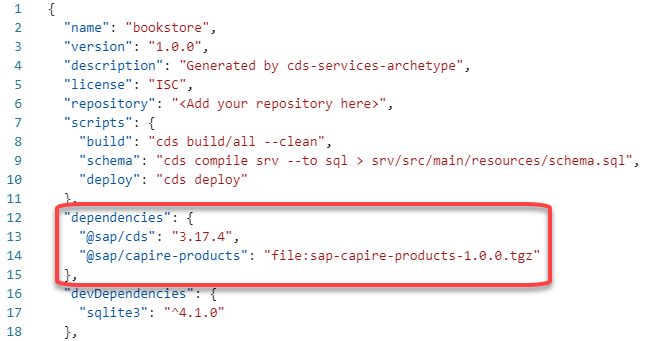

## Define the domain model

Now that you have created your bookstore project, you need to define the domain model.

1. Within the `~/projects/bookstore/db` folder create a file called `schema.cds`.

    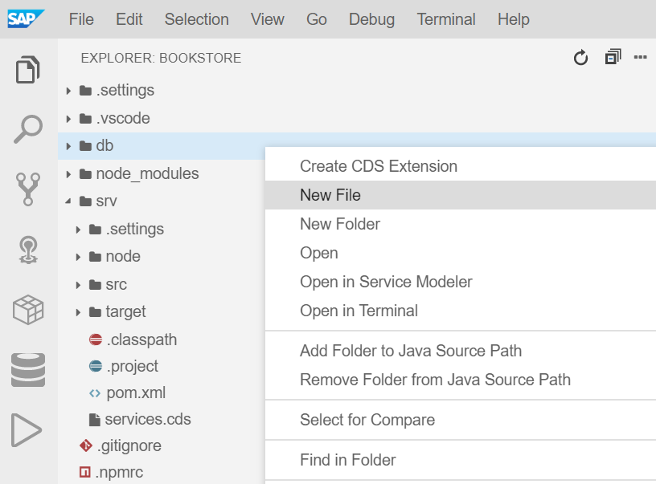

2. Add the following code to your newly created `schema.cds` file:

    ```swift
    namespace sap.capire.bookstore;
    
    using { Currency, cuid, managed }      from '@sap/cds/common';
    using { sap.capire.products.Products } from '@sap/capire-products';
    
    entity Books as projection on Products; extend Products with {
        // Note: we map Books to Products to allow reusing AdminService as is
        author : Association to Authors;
    }

    entity Authors : cuid {
        firstname : String(111);
        lastname  : String(111);
        books     : Association to many Books on books.author = $self;
    }

    @Capabilities.Updatable: false
    entity Orders : cuid, managed {
        items    : Composition of many OrderItems on items.parent = $self;
        total    : Decimal(9,2) @readonly;
        currency : Currency;
    }

    @Capabilities.Updatable: false
    entity OrderItems : cuid {
        parent    : Association to Orders not null;
        book_ID   : UUID;
        amount    : Integer;
        netAmount : Decimal(9,2) @readonly;
    }
    ```

The domain model defines four entities:
- Books
- Authors
- Orders
- OrderItems

Again the `Currency`, `cuid` and `managed` types and aspects are imported, that were introduced in [Exercise 2](../exercise2/README.md). 

In addition, it imports the `Products` entity, which is reused for the `Books` entity. To establish the relation between books and authors, the `Products` entity is extended with an additional association to `Authors`.

The `total` element of the `Orders` entity and the `netAmount` element of the `OrderItems` entity are annotated with [`@readonly`](https://cap.cloud.sap/docs/guides/providing-services#crud). This means the value of these element can not be set by a client. The value is calculated by custom code. You will implement this custom code in [Exercise 4](../exercise4/README.md). Both of these entities are also annotated with [`@Capabilities.Updatable: false`](https://cap.cloud.sap/docs/guides/providing-services#crud), which means that they can not be updated, only created and deleted.

## Define the services

You will now define the services, that should expose the entities you have defined in your domain model:

1. Within the `~/projects/bookstore/srv` folder create a file called `services.cds`

2. Add the following code to the `services.cds` file:

    ```swift
    using { sap.capire.bookstore as db } from '../db/schema';
    
    // Define Books Service
    service BooksService {
        @readonly entity Books as projection   on db.Books { *, category as genre } excluding { category, createdBy, createdAt, modifiedBy, modifiedAt };
        @readonly entity Authors as projection on db.Authors;
    }

    // Define Orders Service
    service OrdersService {
        entity Orders as projection on db.Orders;
        // OrderItems are auto exposed
    }

    // Reuse Admin Service
    using { AdminService } from '@sap/capire-products';
    extend service AdminService with {
        entity Authors as projection on db.Authors;
    }
    ```

The `services.cds` files defines three services:
- BooksService
- OrdersService
- AdminService

The `BooksService` is used to provide a readonly view on the `Books` and `Authors` data. Modifications of these entities is not possible via this service.

The `OrdersService` allows to view, create and delete orders. The entity `OrderItems` is not explicitly listed in the `OrdersService`. However, it will be automatically added to the service (auto-exposed), as the `Orders` entity defines a composition of `OrderItems`.

The `AdminService` is reused from the products service. But we've added the `Authors` entity to it. It can be used to create, update and delete products and authors.
  
It is considered best practice to define services with a single use-case in mind. For example the `AdminService` is meant for administrating Products, Authors and Categories, while the `BooksService` is meant for exposing a catalog of books and authors, hiding administrative data such as creation and modification times from the end-user.

## Define example data

After defining the domain model and the services that you want to expose, you could already start your application. But first, we'd like to add some sample data to your SQLite database. To do so, we'll need to use some CSV files:

1. From your `bookstore` project, right-click the `db` folder and choose **New Folder**. Call the folder `data`.
   
2. Download the CSV data from GitHub by running the following commands in a terminal:

    a. Go to the data folder: `cd ~/projects/bookstore/db/data`
    
    b. Download CSV data for the Authors entity: `curl https://raw.githubusercontent.com/SAP-samples/cloud-cap-samples/CAA160-final/bookstore/db/data/sap.capire.bookstore-Authors.csv -O`

    c. Download CSV data for the Books entity: `curl https://raw.githubusercontent.com/SAP-samples/cloud-cap-samples/CAA160-final/bookstore/db/data/sap.capire.bookstore-Books.csv -O`

    d. Download translated CSV data for the Books entity: `curl https://raw.githubusercontent.com/SAP-samples/cloud-cap-samples/CAA160-final/bookstore/db/data/sap.capire.bookstore-Books_texts.csv -O`

    e. Download CSV data for the Categories entity: `curl https://raw.githubusercontent.com/SAP-samples/cloud-cap-samples/CAA160-final/bookstore/db/data/sap.capire.products-Categories.csv -O`  

You should now have 4 CSV files with sample data. Have a look at the content of these files.

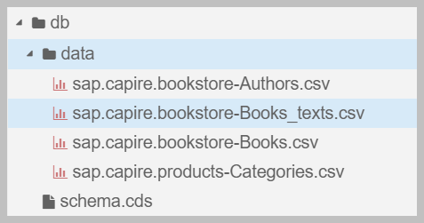

## Deploy the domain model

Let's deploy the domain model again to a SQLite database.

1. First of all install SQLite to the project.

    a. Open the terminal and go to the root of your project: `cd ~/projects/bookstore`
    
    b. Run `npm install --save-dev sqlite3`

2. To initialize the bookstore database with the defined domain model and sample data, run `npm run deploy`

    This will create a file called `sqlite.db` in your project root. The name of this database, is defined by an entry in your `package.json`.
    
    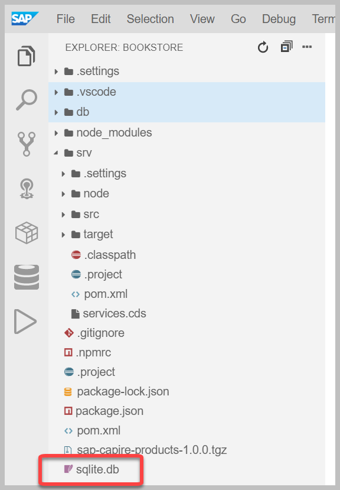

3. To configure your Java application to use the `sqlite.db` database:

    a. Go to `srv/src/main/resources`, locate and open the `application.yaml` file. 
    
    This file was created when you initialized the application.
  
    b. For the field `url` replace the string `"jdbc:sqlite::memory:"` with a reference to your local database `"jdbc:sqlite:/home/user/projects/bookstore/sqlite.db"`

    c. Set the value of `initialization-mode` from `always` to `never`
    
      You can update this value to `never`, because you have already initialized the database when running `npm run deploy`.
      
 4. Configure the SQL Tools in SAP Application Studio to view SQL tables directly:
 
    a. From the main menu of SAP Application Studio, go to **File -> Settings -> Open Preferences**
    
    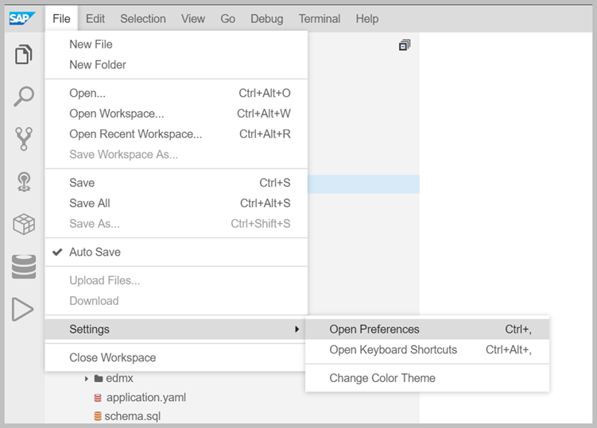
    
    b. Add the following content to the JSON structure in the **User** file:
    
       >Don't forget to add a comma at the end of the existing line.
    
    ```json
        "sqltools.connections": [
            {
                "name": "sqlite",
                "dialect": "SQLite",
                "database": "/home/user/projects/bookstore/sqlite.db"
            }
        ]
    ```
    
    Your **User** file should look like this:
    
    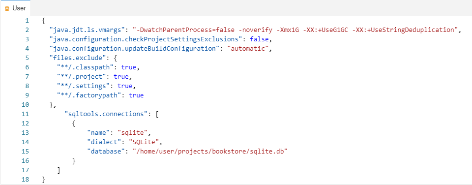
    
    c. Open the SQLTools pane from the side menu:
    
    
    
    d. If prompted click on `Install now` to install the required SQLite tools and then on `Connect to sqlite`
    
    e. You'll see a new connection called **sqlite**. Choose the power cable icon to connect:
    
    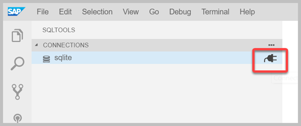
    
    f. Expand **Tables** and open, for example, the Products data by clicking on the magnifying glass as shown below:
    
    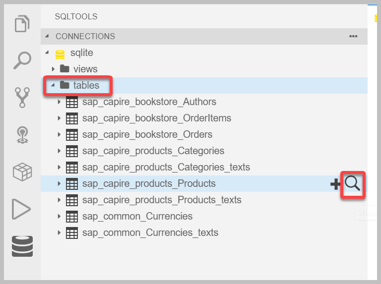
        
    Sometimes the first table selected does not load properly. If that is the case select a different table. You can then switch back to see the Products data:
    
    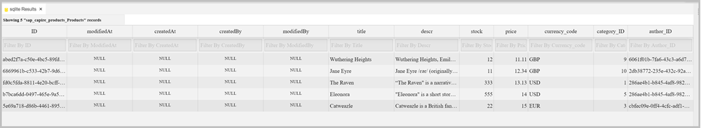
      
## Run and test your bookstore application

1. In the terminal, go to the root of the bookstore project: `cd ~/projects/bookstore`.

2. Ensure that you have stopped all previously running applications (including the `products-service` application) by pressing `CTRL + C`. 
    
    > In case you forgot to stop the `products-service` application and the tab in which it was started is no longer opened you can run `killall mvn` in the terminal to ensure it is terminated.

3. Start your application by running `mvn spring-boot:run`.

4. You'll see a pop-up in SAP Application Studio. Choose **Open in a new tab**.

    When you open the URL in a new tab, you'll see a welcome page. To see the books data, add the following to the end of the URL `/odata/v4/BooksService/Books`.
    
    Your URL should now look similar to:
    
    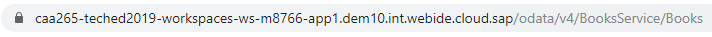
    
    And you should see the books data as follows:
    
    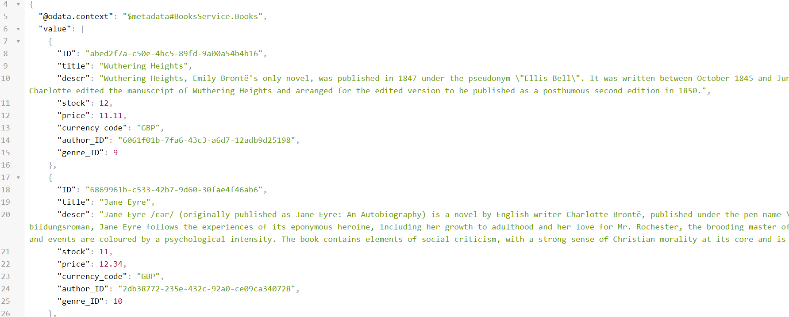
    
    Hint: You can also click on **Books** directly from the welcome page:
    
    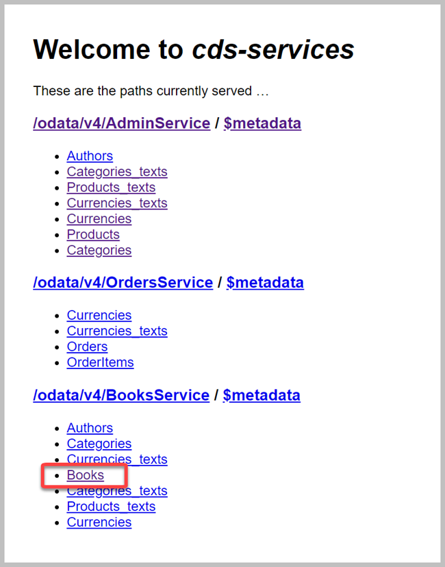

5. To read the localized German example data append the query parameter `?sap-language=de` to the URL. For example `<APP_URL>/odata/v4/BooksService/Books?sap-language=de`. Try to switch the language between German (`de`) and English (`en`).

## Great job!

You have successfully developed the bookstore application AND reused your products service from [Exercise 2](../exercise2/README.md). 

In [Exercise 4](../exercise4/README.md) you'll extend this application with custom code, to calculate the `total` and `netAmount` elements of the `Orders` and `OrderItems` entity. In addition, you'll add custom code that will decrease the stock in the `Books` entity whenever an order is created.
