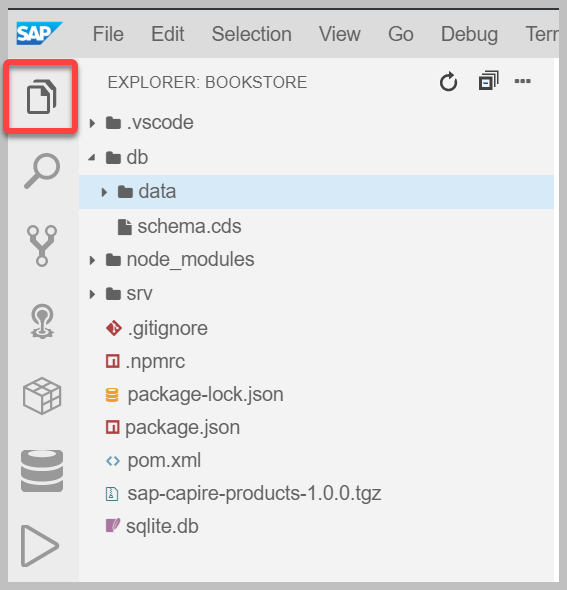
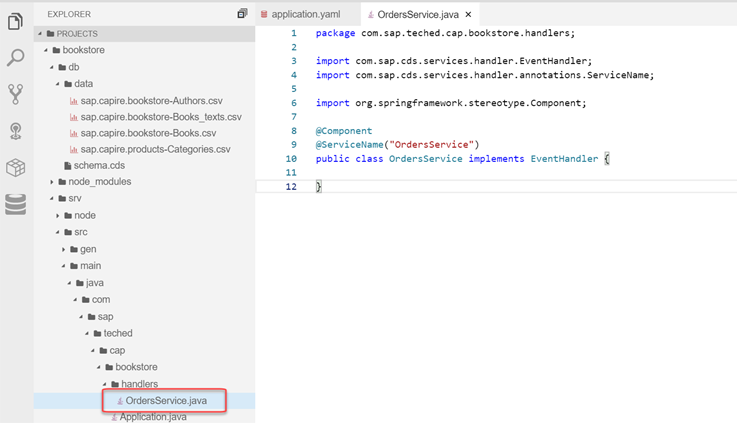
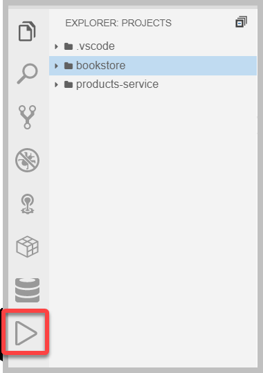

# Exercise 4 - Extending the Bookstore with custom code

In the last exercise you built the data model and exposed the services of your bookstore application. In this exercise you will extend the bookstore with custom code to calculate the `total` and `netAmount` elements of the `Orders` and `OrderItems` entity. In addition when creating an order the available stock of a book will be checked and decreased.

## Code Checkpoint

In case something went wrong in one of the previous exercises, or you want to start from a clean state you can checkout the following code checkpoint:

Run the following command to ensure your code is in sync with the checkpoint: `git checkout -f CAA160-ex3-final`

Some artifacts that are generated during the exercise are not included in the checkpoint. Therefore you need to run the following command after syncing with the checkpoint: `cd ~/projects/bookstore && npm pack ../products-service -s`

## Defining a custom handler for the `OrdersService`

In [Exercise 1](../exercise1/README.md) you have already seen how to register a [custom event handler](https://cap.cloud.sap/docs/java/srv-impl#registering-event-handlers) to handle `READ` or `CREATE` events of an entity. We used the `@On` annotation, which replaces the default handling of an event that is provided by the CAP Java runtime. 

As we want to augment the default handling now, we will use the `@Before` and `@After` annotations. Event handlers registered using the [`@Before`](https://cap.cloud.sap/docs/java/srv-impl#before) annotation are meant to perform validation of the input entity data. This makes it possible to validate the available stock of a particular book before creating an order. In contrast event handlers registered using the [`@After`](https://cap.cloud.sap/docs/java/srv-impl#after) annotation can post-process returned entities. This is useful for calculating the `total` and `netAmount` elements after reading orders or their items from the database.

First of all, a new Java class for your event handler methods needs to be defined:

1. From the terminal, stop your service if it is still running by pressing `CTRL + C`.

2. Go back to the project explorer by choosing the following icon:

   

1. Create the Java package:

   a. Go to `srv/src/main/java/com/sap/teched/cap/bookstore`
   
   b. Create a new folder called `handlers`.

2. In the created package, create the `OrdersService.java` file with the following content:

    ```java
    package com.sap.teched.cap.bookstore.handlers;

    import com.sap.cds.services.handler.EventHandler;
    import com.sap.cds.services.handler.annotations.ServiceName;

    import org.springframework.stereotype.Component;

    @Component
    @ServiceName("OrdersService")
    public class OrdersService implements EventHandler {
        
    }
    ```
    
    

## Decrease the stock upon posting an order

You will now add a method to the `OrdersService` Java class to decrease the stock whenever a new order item is posted.

1. Add the following code to your `OrdersService` Java class:

    ```java
        @Autowired
        PersistenceService db;

        @Before(event = CdsService.EVENT_CREATE, entity = "OrdersService.OrderItems")
        public void validateBookAndDecreaseStock(List<OrderItems> items) {
            for (OrderItems item : items) {
                String bookId = item.getBookId();
                Integer amount = item.getAmount();

                // check if the book that should be ordered is existing
                CqnSelect sel = Select.from(Books_.class).columns(b -> b.stock()).where(b -> b.ID().eq(bookId));
                Books book = db.run(sel).first(Books.class).orElseThrow(() -> new ServiceException(ErrorStatuses.NOT_FOUND, "Book does not exist"));

                // check if order could be fulfilled
                int stock = book.getStock();
                if (stock < amount) {
                    throw new ServiceException(ErrorStatuses.BAD_REQUEST, "Not enough books on stock");
                }

                // update the book with the new stock, means minus the order amount
                book.setStock(stock - amount);
                CqnUpdate update = Update.entity(Books_.class).data(book).where(b -> b.ID().eq(bookId));
                db.run(update);
            }
        }

        @Before(event = CdsService.EVENT_CREATE, entity = "OrdersService.Orders")
        public void validateBookAndDecreaseStockViaOrders(List<Orders> orders) {
            for(Orders order : orders) {
                validateBookAndDecreaseStock(order.getItems());
            }
        }
    ```

2. Add the following import statements to the top of the `OrdersService` Java class:

    ```java
    import java.util.List;
    import org.springframework.beans.factory.annotation.Autowired;

    import com.sap.cds.ql.Select;
    import com.sap.cds.ql.Update;
    import com.sap.cds.ql.cqn.CqnSelect;
    import com.sap.cds.ql.cqn.CqnUpdate;
    import com.sap.cds.services.ErrorStatuses;
    import com.sap.cds.services.ServiceException;
    import com.sap.cds.services.cds.CdsService;
    import com.sap.cds.services.handler.annotations.Before;
    import com.sap.cds.services.persistence.PersistenceService;

    import ordersservice.OrderItems;
    import ordersservice.Orders;
    import sap.capire.bookstore.Books;
    import sap.capire.bookstore.Books_;
    ```

Let's break down what is happening:
- The method `validateBookAndDecreaseStock` is registered using the `@Before` annotation. This means the method is called before the `OrderItems` entities are persisted. The annotation also specifies, that the method should be called whenever an entity `OrderItems` is created.
- The method has a parameter `items` which gives access to the list of `OrderItems`. The interface used here is generated by CAP Java. It generates a [POJO interface](https://cap.cloud.sap/docs/java/result-handling) for each entity defined in the CDS model.
- The `CqnSelect sel` variable defines a database query to retrieve the book that is referenced by the order item. The query is performed and the returned entity data is accessed using the POJO interface for `Books`.
- After that the available stock of the book is compared against the ordered amount. If enough stock is available the stock is decreased on the book and the book is updated within the database.
- As order items can also be created via a [deep insert](https://cap.cloud.sap/docs/java/srv-run#deep-insert--upsert) on the `Orders` entity, the same validation is triggered by the `validateBookAndDecreaseStockViaOrders` method.

It is important to note, that the CAP Java stack automatically takes care of combining all database queries and updates in a single transaction. This means, that if the creation of the order item fails for some reason, the stock of the book will not be decreased.

### Testing the handler

1. Go to the terminal in SAP Application Studio and stop your application if it is still running by pressing `CTRL + C`.

2. Choose the **Run Configuration** icon on the side panel of SAP Application Studio.

   
   
3. Choose the **Create Configuration** icon (plus sign) and select **Bookstore** as your project to run.

4. Click on the green arrow to start the application, which appears when you hover over the run configuration.

   You should see the application starting in the **Debug Console**. 

5. Test your application, by using curl from the terminal. 

   To open a new terminal, choose **Terminal, New Terminal** from the main menu.
    
    a. Create a new order:
    
    ```bash
    curl -X POST http://localhost:8080/odata/v4/OrdersService/Orders \
    -H "Content-Type: application/json" \
    -d '{"ID": "50425a69-48b9-45f1-b6d2-687d55355e03", "currency_code": "USD"}' 
    ```

    b. Create a new order item:
    
    ```bash
    curl -X POST http://localhost:8080/odata/v4/OrdersService/OrderItems \
    -H "Content-Type: application/json" \
    -d '{"parent_ID": "50425a69-48b9-45f1-b6d2-687d55355e03", "book_ID": "abed2f7a-c50e-4bc5-89fd-9a00a54b4b16", "amount": 2}' 
    ```
    
    c. From the welcome page, choose **Books** and you'll see that the stock of the book `Wuthering Heights` was decreased to 10.
    
    You can also add `/odata/v4/BooksService/Books` to the end of your app URL. Remember the "app URL" is the URL created when you run your application.

    d. Repeat the curl request from step b, until you get an error that the book ran out of stock.
    
      Basically, by repeating the curl request, you are ordering 2 books each time and therefore decreasing the stock by 2.

    e. To reset the database to the initial state, run `npm run deploy` from the root of your project (`cd ~/projects/bookstore`).
    
## Calculate the netAmount of an order item

Next, let's add a method to the `OrdersService` Java class to calculate the `netAmount` element of the `OrderItems` entity. 

1. Add the following code to the class:

    ```java
        @After(event = { CdsService.EVENT_READ, CdsService.EVENT_CREATE }, entity = "OrdersService.OrderItems")
        public void calculateNetAmount(List<OrderItems> items) {
            for (OrderItems item : items) {
                String bookId = item.getBookId();

                // get the book that was ordered
                CqnSelect sel = Select.from(Books_.class).where(b -> b.ID().eq(bookId));
                Books book = db.run(sel).single(Books.class);

                // calculate and set net amount
                item.setNetAmount(book.getPrice().multiply(new BigDecimal(item.getAmount())));
            }
        }
    ```

2. In addition add the following import statements to the top of the `OrdersService` Java class:

    ```java
    import java.math.BigDecimal;

    import com.sap.cds.services.handler.annotations.After;
    ```

Let's break it down again:
- The method `calculateNetAmount` is registered using the `@After` annotation. This means the method is called after the `OrderItems` entities have been read from the database. The annotation also specified, that the method should be called whenever an entity `OrderItems` is read or created.
- The method has a parameter `items` that gives access to all `OrderItems` entities that were either read or created.
- The `CqnSelect sel` variable defines a database [query](https://cap.cloud.sap/docs/java/cds-ql), to retrieve the book that is referenced by the order item. The query is [executed](https://cap.cloud.sap/docs/java/srv-run#query-execution) and the [query result](https://cap.cloud.sap/docs/java/result-handling) is accessed using the POJO interface for `Books`.
- In the last line the net amount of the order item is calculated, based on the price of the book and the amount of books ordered.

### Testing the handler

1. In SAP Application Studio stop your application if it is still running by clicking on the red stop icon in the **Debug** side panel.

2. Choose the **Run Configuration** icon on the side panel of SAP Application Studio.

   

3. Click on the green arrow to start the application, which appears when you hover over the run configuration.

   You should see the application starting in the **Debug Console**. 

4.  Test your application, by using curl from the terminal. To open a new terminal, choose **Terminal, New Terminal** from the main menu.

    a. Create a new order:
        
    ```bash
    curl -X POST http://localhost:8080/odata/v4/OrdersService/Orders \
    -H "Content-Type: application/json" \
    -d '{"ID": "017f4ac4-7f07-4c07-a009-3168317a10cf", "currency_code": "USD"}' 
    ```

    b. Create a new order item. You can already observe the calculated element in the returned response
        
    ```bash
    curl -X POST http://localhost:8080/odata/v4/OrdersService/OrderItems \
    -H "Content-Type: application/json" \
    -d '{"parent_ID": "017f4ac4-7f07-4c07-a009-3168317a10cf", "book_ID": "fd0c5fda-8811-4e20-bcff-3a776abc290a", "amount": 4}' 
    ```

    c. From the welcome page, choose **OrderItems** and you'll see that the `netAmount` element is filled with the calculated value.
    
       You can also add `/odata/v4/OrdersService/OrderItems` to the end of your app URL.
  

## Calculate the total amount of an order

Finally, add a method to the `OrdersService` Java class to calculate the `total` element of the `Orders` entity. 

1. Add the following code to the class:

    ```java
        @After(event = { CdsService.EVENT_READ, CdsService.EVENT_CREATE }, entity = "OrdersService.Orders")
        public void calculateTotal(List<Orders> orders) {
            for (Orders order : orders) {
                // calculate net amount for expanded items
                calculateNetAmount(order.getItems());

                // get all items of the order
                CqnSelect selItems = Select.from(OrderItems_.class).where(i -> i.parent().ID().eq(order.getId()));
                List<OrderItems> allItems = db.run(selItems).listOf(OrderItems.class);

                // calculate net amount of all items
                calculateNetAmount(allItems);

                // calculate and set the orders total
                BigDecimal total = new BigDecimal(0);
                for(OrderItems item : allItems) {
                    total = total.add(item.getNetAmount());
                }
                order.setTotal(total);
            }
        }
    ```

2. Also add the following import statements to the top of the `OrdersService` Java class:

    ```java
    import sap.capire.bookstore.OrderItems_;
    ```

Let's break the code down:
- Again the `@After` annotation is used to register the method and to indicate that the method should be called, whenever the `Orders` entity was read or created.
- For the order items, that may be returned as part of the operation, the net amount is calculated, reusing the `calculateNetAmount` method. Please note that this may only be a subset of all of the order's items.
- For each order all of the order items are read from the database using the query defined in `CqnSelect selItems`.
- For each order item the net amount is calculated first by reusing the method `calculateNetAmount`. After that all net amounts are added to the order's total amount.

### Testing the handler

1. In SAP Application Studio stop your application if it is still running by clicking on the stop icon in the **Debug** side panel.

2. Choose the **Run Configuration** icon on the side panel of SAP Application Studio.

   

3. Click on the green arrow to start the application, which appears when you hover over the run configuration.

   You should see the application starting in the **Debug Console**. 

4. Test your application by sending various requests.

    a. From the welcome page, choose **Orders**. You'll see that the `total` element is filled with the calculated value. 
    
      You can also add `/odata/v4/OrdersService/Orders` to the end of your app URL.

    b. Add `/odata/v4/OrdersService/Orders?$expand=items` to the end of your app URL. 
    
      This expands the `Orders` with it's `OrderItems`. You'll see that the `netAmount` element of the `OrderItems` is calculated.

5. Stop your application by clicking on the stop icon in the **Debug** side panel.

## Great job!

You have extended the application with quite some custom business logic. In [Exercise 5](../exercise5/README.md) you will start to make the application ready for SAP Cloud Platform, by running it with SAP HANA as the database.
