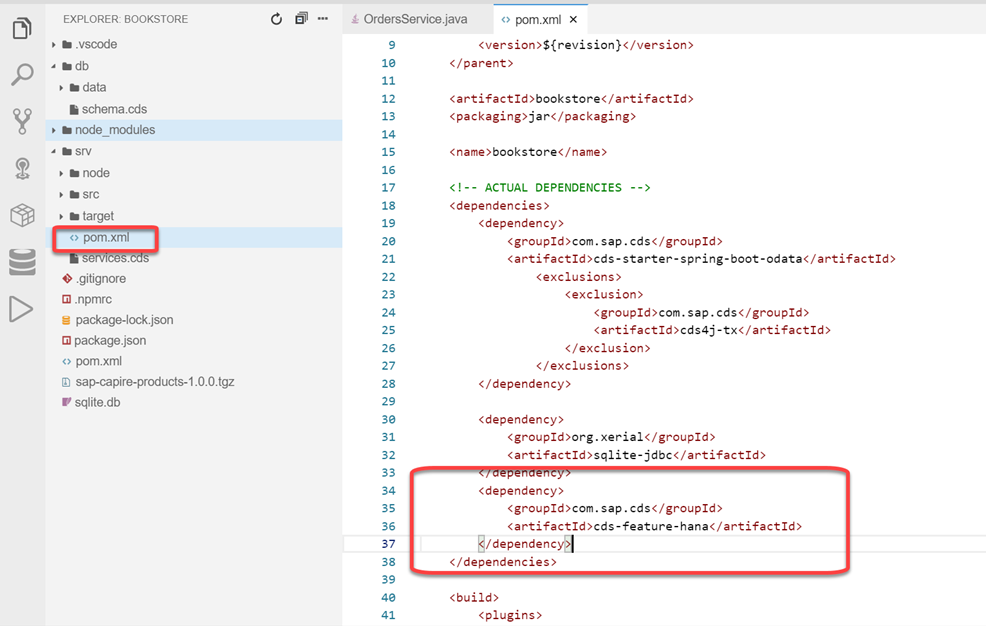

# Exercise 5 - Using SAP HANA as your database

In the last exercise you have added custom coding to your bookstore application. In this exercises you will make the application ready to be deployed to the cloud. In order to make our application cloud-ready, we'll switch to SAP HANA as our database.

## Creating a CloudFoundry Trial account

The following two exercises require access to an SAP Cloud Platform account with a Subaccount for the Cloud Foundry environment.
The subaccount needs to have the following entitlements assigned to it:

1. Service: 'SAP HANA Schemas & HDI Containers' or Service 'SAP HANA Schemas & HDI Containers (Trial)' 
   Plan: 'hdi-shared'
   Quota: 1 Unit
2. Service: 'Application Runtime'
   Plan: 'MEMORY'
   Quota: 1 GiB

You can use a free trial account for this. Please follow [this tutorial](https://developers.sap.com/tutorials/hcp-create-trial-account.html) to create a free trial account.

## Initializing the SAP HANA database

First you need to create and initialize a SAP HANA database schema in the cloud. As you will deploy your application to SAP Cloud Platform Cloud Foundry Environment, you will also create the SAP HANA service there.

Login to the Cloud Foundry Environment using the cf CLI:

1. In SAP Application Studio, open a terminal by choosing **Terminal, New Terminal** from the main menu.

2. Run `cf api <CF_API>` in the terminal. 

   The `<CF_API>` endpoint can be obtained from the Overview page of your Subaccount in Cloud Cockpit.

3. Run `cf login -a <CF_API>` and authenticate using your login credentials.

Initializing the SAP HANA database is now as simple as running these commands in the terminal:

1. Make sure that you are in the root of the bookstore project: `cd ~/projects/bookstore`

2. Run `npm install --save-dev --save-exact @sap/hdi-deploy@3.7.0`

3. Run `cds deploy --to hana:bookstore-hana`

   With this command, you've created an SAP HANA service instance. In addition, the command initialized the database schemas inside the SAP HANA HDI container.

## Configure your application to use SAP HANA locally

Aside from initializing the SAP HANA database, the `cds deploy` command created a file with the name `default-env.json` in your `bookstore` root folder. This file contains a set of credentials to connect to the SAP HANA HDI container, that was created by the command. CAP Java is able to automatically pick up the SAP HANA credentials from this file and configure the application running locally to use the SAP HANA HDI container as the database. 

When deploying the application to the cloud, Cloud Foundry will provide the credentials as a service binding to the application through the Open Service Broker API. Also in this case, CAP Java will automatically pick up the SAP HANA credentials and configures the application for you as you will see later on in [Exercise 6](../exercise6/README.md).

The described features are available as a plugin in CAP Java. Therefore, we'll add an additional Maven dependency to your project. The dependency will bring the ability to read SAP HANA service bindings from the default-env.json to automatically configure the SAP HANA connectivity. In addition, it includes the SAP HANA JDBC driver. 

1. Edit the `pom.xml` in the `srv` directory (not the `pom.xml` file located in the root project folder) and add the following dependency under the `<dependencies>` tag:

   ```xml
       <dependency>
           <groupId>com.sap.cds</groupId>
           <artifactId>cds-feature-hana</artifactId>
       </dependency>
   ```

   
  
2. Before starting your application, make sure you stop any running instances in the terminal or debug side panel.

3. Make sure that you are in the root of the bookstore project: `cd ~/projects/bookstore`

4. Let's test the SAP HANA connectivity. Start your application by running `mvn spring-boot:run -Dspring-boot.run.profiles=cloud`

    > Note: The Java system property `-Dspring-boot.run.profiles=cloud` ensures that the default configuration using SQLite as the database, which is still defined in the `application.yaml`, does not get activated.

5. You can observe the log lines `Loaded default-env.json from directory '/home/user/projects/bookstore'` and `Registered primary 'DataSource' bean definition for connected service 'bookstore-hana'` which indicate that the SAP HANA configuration was picked up.

6. Try the following example request, which creates an order together with it's items through a deep insert:

    Open a new terminal by choosing **Terminal, New Terminal** from the main menu.

    a. Create a new order together with items:
        
    ```bash
    curl -X POST http://localhost:8080/odata/v4/OrdersService/Orders \
    -H "Content-Type: application/json" \
    -d '{ "currency_code": "USD", "items": [ { "book_ID": "b7bca6dd-0497-465e-9a5a-56f244174c8c", "amount": 1 } ] }' 
    ```

## Great job!

You have successfully deployed your database schema to SAP HANA and connected your application, which is running locally. In [Exercise 6](../exercise6/README.md) you'll run the application on the Cloud Foundry environment, using the SAP HANA service instance that was created in this exercise.

