# Exercise 2: Create a Reviews Service with Synchronous and Asynchronous APIs

## Estimated time

30 minutes

## Objective

In this exercise, you'll use CDS to develop a reviews service which is able to emit events. With this, your consuming application can react on changes without the need to trigger synchronous requests. It doesn't even need to be running when changes occur since events are safely stored in a queue. By the end of this exercise, you will have implemented actions, created events and have a service ready to be consumed by the bookstore application.

## Notes
For all exercises please make sure to use **Google Chrome**. If you haven't completed [Exercise 1](../exercise01/README.md), simply clone [this branch](https://github.com/SAP-samples/cloud-cap-samples/tree/CAA265-node-ex1-final) and immediately continue with Exercise 2.

## Content

- [Part A: Create the reviews-service](./README.md#part-a-create-the-reviews-service)
- [Part B: Add custom logic to implement OData actions](./README.md#part-b-add-custom-logic-to-implement-odata-actions)
- [Part C: Add an event emitter to your service](./README.md#part-c-add-an-event-emitter-to-your-service)

## Exercise description

### Part A: Create the reviews-service

1. In the **Run Configurations** menu where our bookstore service is running:

   a. Choose the stop button:
   
   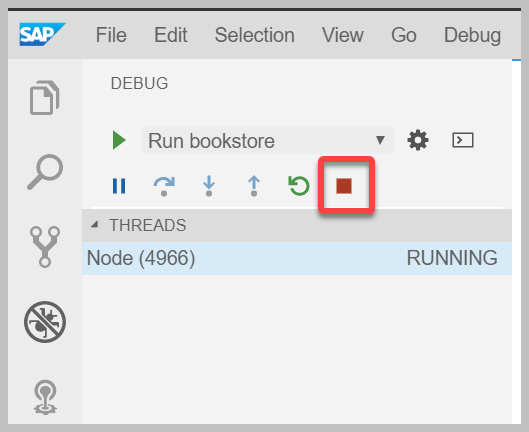
   
   b. Go back to the project explorer.
 
   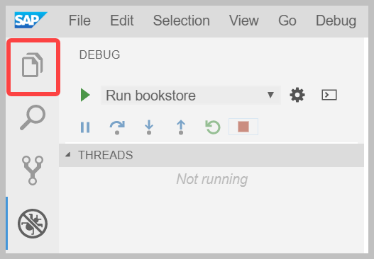

  > In the terminal check that you are in the right directory with the command **pwd**.
  
  >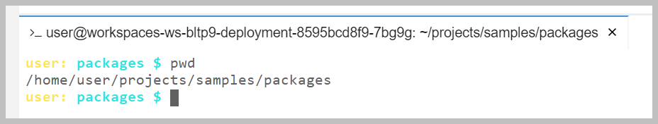

3. In the **projects/samples/packages** directory, create a new CDS project for the reviews service by executing:

    ```
    cds init reviews-service
    ```

    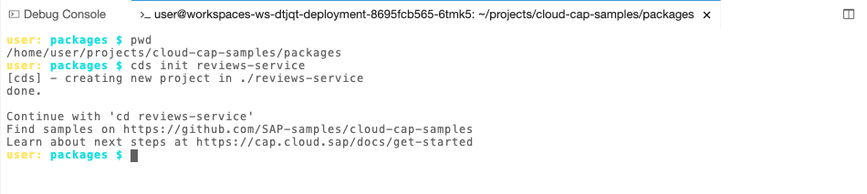

4. To add the CDS domain model, right-click the **reviews-service** project folder:

   a. Choose **New File**.
   
   b. Call it `db/schema.cds`.
   
5. In the newly created **schema.cds** file, add the following code:

    ````swift
    namespace sap.capire.reviews;
    using { User } from '@sap/cds/common';

    // Reviewed subjects can be any entity that is uniquely identified
    type ReviewedSubject : String(111);

    entity Reviews {
      key ID   : String(36);
      subject  : ReviewedSubject;
      reviewer : User;
      rating   : Rating;
      title    : String(111);
      text     : String(1111);
      date     : DateTime;
      likes    : Composition of many Likes on likes.review = $self;
      liked    : Integer default 0; // counter for likes as helpful review (count of all _likes belonging to this review)
    }

    type Rating : Integer enum {
      Best  = 5;
      Good  = 4;
      Avg   = 3;
      Poor  = 2;
      Worst = 1;
    }

    entity Likes {
      key review : Association to Reviews;
      key user   : User;
    }
    ````

    This CDS model defines one entity for the `Reviews` and one entity for the `Likes` associated with each `Review`.

    The `Reviews` are uniquely identified by the key `ID` and can contain many likes: `likes    : Composition of many Likes on likes.review = $self;`.

    Review ratings are further defined by a type `Rating`.
    
    [Learn more about modelling data with CDS](https://cap.cloud.sap/docs/cds/cdl).

5. To add the CDS service definition, right-click the **reviews-service** project folder:
   
   a. Select **New File**.
   
   b. Create a file called `srv/reviews-service.cds`. 

6. In the newly created **reviews-service.cds** file, add the following code:

    ```swift
    namespace sap.capire.reviews;
    using { sap.capire.reviews as my } from '../db/schema';

    service ReviewsService {
      // API
      entity Reviews as projection on my.Reviews excluding { likes }
      action like (review:Reviews.ID);
      action unlike (review:Reviews.ID);  

      // Input validation
      annotate Reviews with {
        subject  @mandatory;
        title    @mandatory;
        rating   @mandatory @assert.enum;
      }

      // Auto-fill reviewers and review dates
      annotate Reviews with {
        reviewer @cds.on.insert:$user;
        date     @cds.on.insert:$now;
        date     @cds.on.update:$now;
      }
    }
    ```

    With this service definition we define the API of our service. We expose `Reviews` as a projection on `my.Reviews` which we defined in the CDS data model. We also declare two actions `like` and `unlike` that we will implement in [Part B](./README.md#part-b-add-custom-logic-to-implement-odata-actions). [Learn more about defining services in CDS here.](https://cap.cloud.sap/docs/cds/cdl#services)
    
    Next, we mark the fields `subject`, `title` and `rating` as `mandatory`. If the values are not provided in a create or update request, the request is rejected. [Learn more about input validation in CDS here.](https://cap.cloud.sap/docs/guides/providing-services#input-validation)

    Lastly, we define the fields `reviewer` and `date` to be filled by the framework. The `reviewer` is set to the current user. `Date`is set to the current timestamp of the update or insert request. [Learn more about adminstrative data in CDS here.](https://cap.cloud.sap/docs/guides/providing-services#administrative-data)

### Part B: Add custom logic to implement OData actions

1. In the same **srv** folder of your **reviews-service** project:

   a. Right-click and choose **New File**.
   
   b. Create a `reviews-service.js` file.

    This is where we will add the custom coding for the OData actions 'like' and 'unlike'.

    Paste the following code in the file:

    ```javascript
    const cds = require('@sap/cds')
    module.exports = cds.service.impl((srv) => {

      // Get the CSN definition for Reviews from the db schema for sub-sequent queries
      // ( Note: we explicitly specify the namespace to support embedded reuse )
      const { Reviews, Likes } = cds.entities('sap.capire.reviews')

      // Increment counter for reviews considered helpful
      srv.on ('like', (req) => {
         if (!req.user)  return req.reject(400, 'You must be identified to like a review')
         const {review} = req.data, {user} = req
         const tx = cds.transaction(req)
         return tx.run ([
           INSERT.into (Likes) .entries ({review_ID: review, user: user.id}),
           UPDATE (Reviews) .set({liked: {'+=': 1}}) .where({ID:review})
         ]).catch(() => req.reject(400, 'You already liked that review'))
      })

      // Delete a former like by the same user
      srv.on('unlike', async (req) => {
          if (!req.user) return req.reject(400, 'You must be identified to remove a former like of yours')
          const { review } = req.data, { user } = req
          const tx = cds.transaction(req)
          const affectedRows = await tx.run(DELETE.from(Likes).where({ review_ID: review, user: user.id }))
          if (affectedRows === 1) return tx.run(UPDATE(Reviews).set({ liked: { '-=': 1 } }).where({ ID: review }))
       })
    })
    ```

    This code enables custom handlers for the actions `like` and `unlike`. Whenever you `like` a review, 
    a new entry in the table for `Likes` will be created. Additionally, the amount of likes of that review is
    increased by one. In case the request is triggered by an unidentified user or if the user already liked that review
    an appropriate error message is sent. The action `unlike` works similarly.

2. Run the reviews service

   a. From the terminal, run the reviews service with `cds run reviews-service --in-memory`.

   b. When prompted, click on **Open in New Tab** for the port 4004.
   
    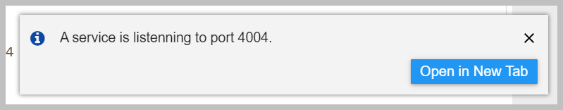
   
    The browser tab you just opened accessing the running service should look like this:

    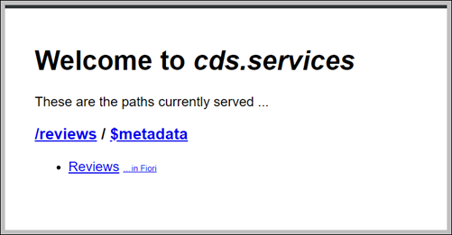

3. To test the reviews service, we need to create the first review.

     a. In SAP Application Studio, open a new terminal from the main menu: **Terminal** -> **New Terminal**.
     
     b. In the new terminal execute:

    ```
    curl -X POST http://localhost:4004/reviews/Reviews \
    -H "Content-Type: application/json" \
    -d '{
    "ID":"201",
    "subject":"Wuthering Heights",
    "rating":2,
    "title":"Great book!"
    }'
    ```

    Congratulations, you just created your first review! You can view it by clicking the **Reviews** link in your browser window exposing the running reviews service.

    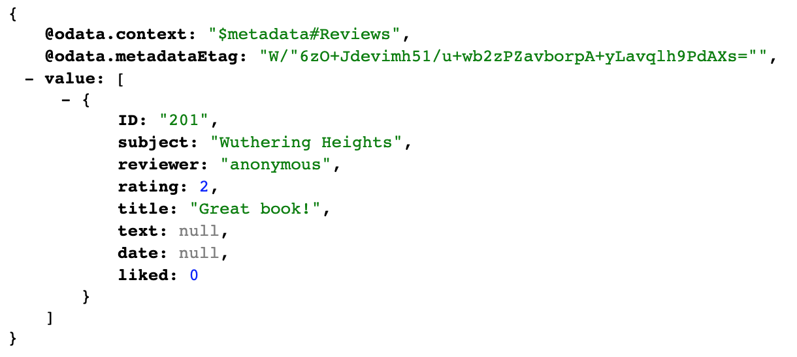

4. Now, let's test the actions **like** and **unlike** we just implemented in our service.

   a. To like the review, run the following curl request:

   ```
   curl -X POST http://localhost:4004/reviews/like \
   -H "Content-Type: application/json" \
   -d '{"review":"201"}'
   ```
   
   When you refresh the tab with the running reviews service, you should see that the review has 1 **like** now.
   
   

   b. To unlike a review, execute:
  
    ```
    curl -X POST http://localhost:4004/reviews/unlike \
    -H "Content-Type: application/json" \
    -d '{"review":"201"}'
    ```
    
    If you refresh again, the **like** is now removed.

### Part C: Add an event emitter to your service

We will now add an event that is emitted whenever a review is created, updated or deleted.

[Learn more about adding events and messages in CAP here.](https://cap.cloud.sap/docs/guides/providing-services#add-custom-logic)

1. In your **reviews-service** project folder, go to the **srv** folder and open the **reviews-service.cds** file.

   Find the service definition (*`service ReviewsService { [..] }`*) and add the following event declaration:

    ````swift
    event reviewed : { subject:String; rating: Decimal(2,1) };
    ````

    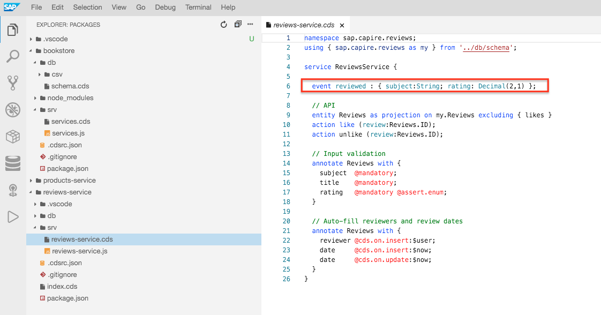

2. Now go to the **reviews-service.js** file located in the same folder.

   Within the service implementation (*`module.exports = cds.service.impl ((srv) => { [..] } )`*) add the following logic:

    ```js
      // Emit an event to inform subscribers about new avg ratings for reviewed subjects
      // ( Note: req.on.succeeded ensures we only do that if there's no error )
      srv.after(['CREATE', 'UPDATE', 'DELETE'], 'Reviews', async (_, req) => {
        const { subject } = req.data
        const { rating } = await cds.transaction(req).run(
          SELECT.one(['avg(rating) as rating']).from(Reviews).where({ subject })
        )
        req.on('succeeded', () => {
          srv.emit('reviewed', { subject, rating })
          console.log(`Reviewed event was emitted for book "${subject}" with rating ${rating}.`)
        })
      })
    ```

    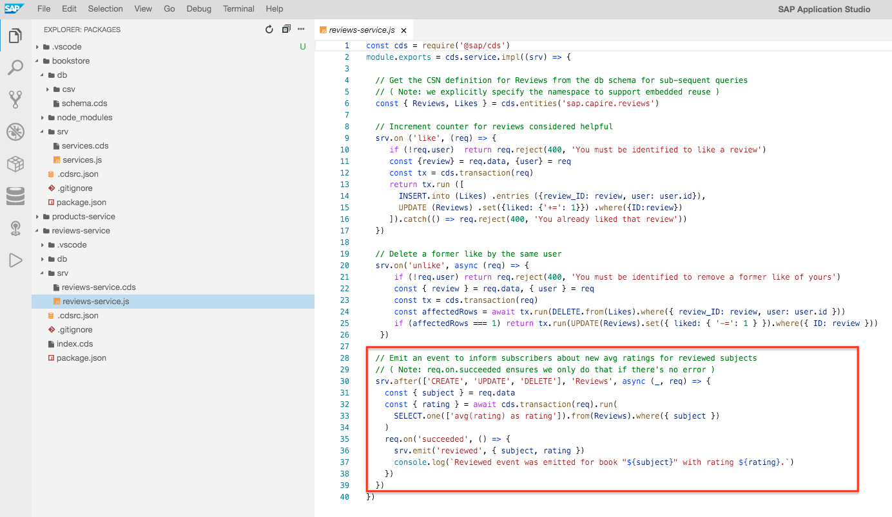
    
    [comment]: # (TODO: Screenshot slightly different)


    Here we implemented a custom event handler that is called after every create, update and delete request on the exposed entity `Reviews`. If the request succeeds, a `reviewed` event is emitted that contains the reviewed subject and its average rating. [Learn more about custom handlers here.](https://cap.cloud.sap/docs/guides/providing-services#add-custom-logic)


3. Let's test the latest additions to the reviews service:

    a. From the terminal where the **reviews-service** is running, press `Ctrl + C` and then execute `cds run reviews-service --in-memory`.
    
    This restarts your service, so the changes can take effect.
    
    b. Go to the other terminal (where you executed the other curl requests) and run:

    ```
    curl -X POST http://localhost:4004/reviews/Reviews \
    -H "Content-Type: application/json" \
    -d '{
    "ID":"202",
    "subject":"Wuthering Heights",
    "rating":5,
    "title":"My favourite book!"
    }'
    ```
  
    Back in the console where the **reviews-service** is running you should see the following message:
    
    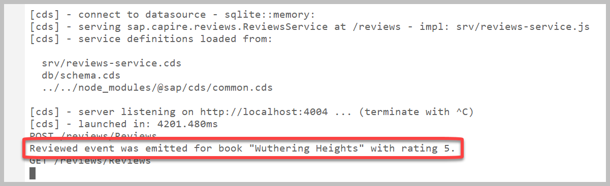

    In the next exercise, we will consume this event in the **bookstore** application and see it in action.

### Part D: Expose the reviews service

1. In the **reviews-service** project folder, create a new file called `index.cds`.
  
   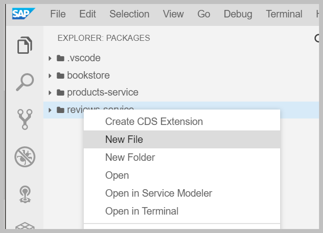

2. Add the following content to expose the reviews service:

   ```
   using from './srv/reviews-service';
   ```
   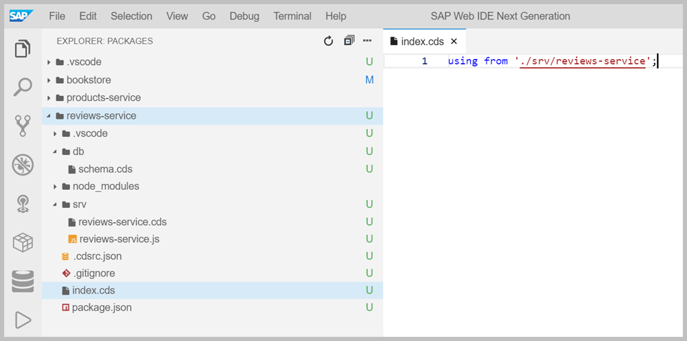

### Congratulations!

You have just created your first event emitting service with CDS. In [Exercise 3](../exercise03/README.md), we are going to use it in the bookstore application.
