# Exercise 3: Consume the Reviews Service from the Bookstore

## Estimated time

30 minutes

## Objective

In this exercise, the bookstore and reviews service will come together. The bookstore will consume both the asynchronous and synchronous API that the reviews service exposes. By the end of this exercise, you will have set up the bookstore and reviews service for consumption, consumed events and exposed an entity of the reviews service from the bookstore.

## Notes

For all exercises please make sure to use **Google Chrome**. If you haven't completed [Exercise 2](../exercise02/README.md), simply clone [this branch](https://github.com/SAP-samples/cloud-cap-samples/tree/CAA265-node-ex2-final) and immediately continue with Exercise 3.

## Content

- [Part A:  Reuse the reviews-service](./README.md#part-a-reuse-the-reviews-service)
- [Part B: Subscribe to and handle reviewed events](./README.md#part-b-subscribe-to-and-consume-reviewed-events)
- [Part C: Consume events of an external service](./README.md#part-c-consume-events-of-an-external-service)
- [Part D: Expose entities of the external reviews service](./README.md#part-d-expose-entities-of-the-external-reviews-service)

## Exercise description


1. In the terminal where your service is running, press `Ctrl + C` to stop your service.

   And run the following command:
  
    ```sh
    npm install $(npm pack ./reviews-service -s)
    ```

    This creates an archive inside the packages directory, as it would if you were going to publish the package to an npm registry.
    
    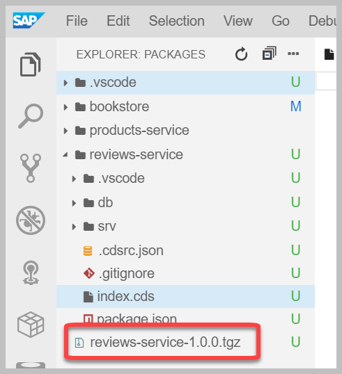

2. Now to consume the reviews service from the bookstore, open the **bookstore** project folder and open the `package.json` file. 

   Add the following dependency in `dependencies: {[..]}`:

   ```
   "reviews-service": "file:packages/reviews-service-1.0.0.tgz",
   ```

    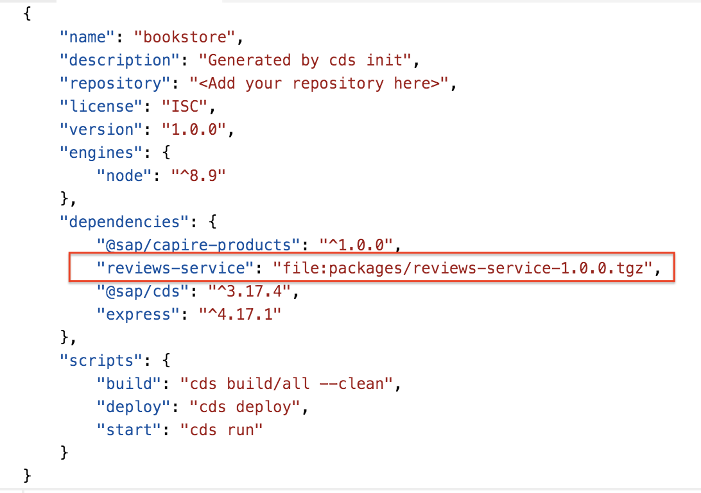

3. Go to the terminal and from the **packages** directory, execute `npm install` to install the reviews service module.

   Now that the dependency to the reviews service is declared and the module installed, we need to import the reviews service definition in the bookstore service.

4. In the **bookstore** project folder, go to **srv** folder and open the file `services.cds`.

   Add the following content:

   ```swift
   // Adding reviews via capire-reviews service
   using { sap.capire.reviews.ReviewsService } from 'reviews-service';
   ```

   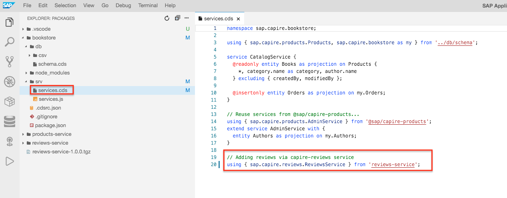

    This imports the **reviews-service** service definition in the bookstore.

5. To test the reuse, we'll run the bookstore application. From the terminal execute:

    ```sh
    cds run bookstore --in-memory
    ```

6. When prompted, click on **Open in New Tab**.

   You can also reopen the browser window with the landing page of the reviews-service.

    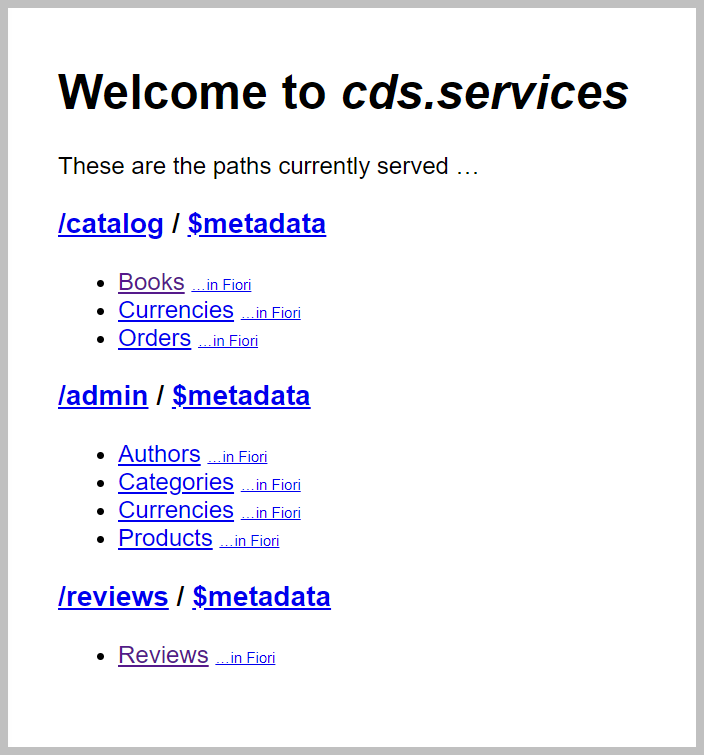

    Here we see that the **reviews-service** is now exposed as `/reviews` and was started together with the bookstore.

    Now that everything is set up, we will consume the event created in [Exercise 2](/exercises/exercise02/README.md).

### Part B: Subscribe to and consume reviewed events

1. Go to the **bookstore** project folder and open the `services.js` file, located in the **srv** folder. Add the following content:

 ```js
    const reviews_srv = await cds.connect.to('sap.capire.reviews.ReviewsService')

    // react on event messages from reviews service
    reviews_srv.on('reviewed', (msg) => {
        console.debug('> received', msg)
    })
 ```

   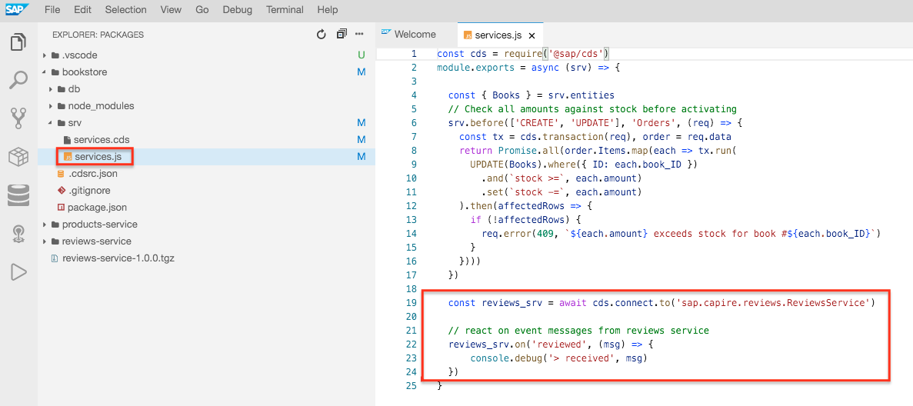

   Here we connect to the reviews service and register an event handler that listens to the **reviewed** event.

2. Now, let's restart the service and test if the event is sucessfully consumed.
 
     a. Press `Ctrl + C` to stop the running service in the terminal.

     b. In the terminal, execute `cds run bookstore --in-memory`. 
    
      Choose **Open in New Tab**.

     c. Now, open a new terminal with **Terminal** -> **New Terminal**.
  
     d. Paste and execute the following curl command in a new the terminal:

    ```sh
      curl -X POST http://localhost:4004/reviews/Reviews \
      -H "Content-Type: application/json" \
      -d '{
        "ID":"201",
        "subject":"Wuthering Heights",
        "rating":2,
        "title":"Great book!"
      }'
    ```

    In the terminal where the **bookstore** is running you will see the output:

    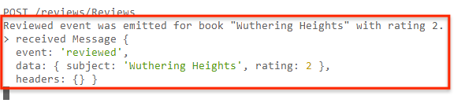

### Part C: Consume events of an external service

In order to consume events of the reviews service as an external service, we only need to adapt the `package.json` file of the bookstore service. The event handler implementation can remain unchanged.

1. First, go to the **bookstore** project folder:

   a. Open the `package.json` file.
   
   b. Add the following before the last closing bracket:

    ```
    ,
    "cds": {
      "requires": {
        "sap.capire.reviews.ReviewsService": {
          "model": "reviews-service",
          "kind": "odata",
          "credentials": {
            "file": "default"
          }
        }
      }
    }
    ```

    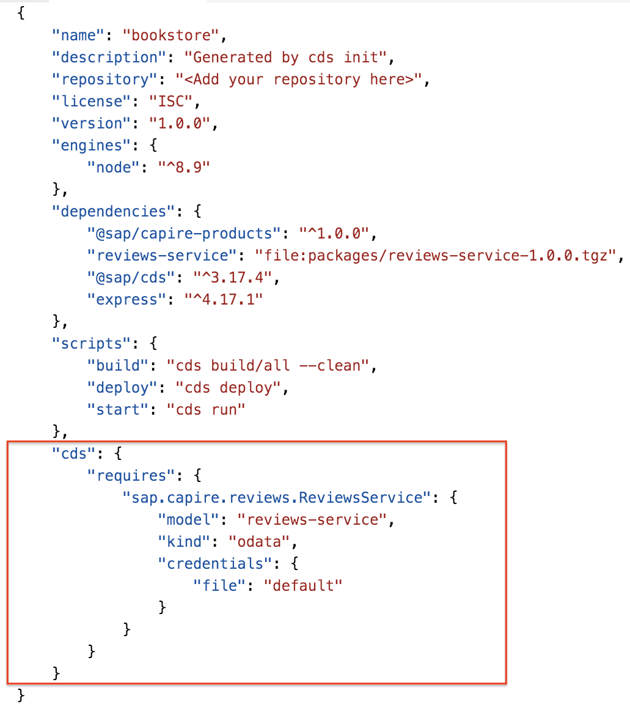
    
    [comment]: # (TODO: Screenshot slightly different)


2. To test our changes, we need to stop the bookstore and start the bookstore and reviews service at different ports.

     a. Stop the bookstore service in the terminal where you started it by executing `Ctrl + C`.

     b. In the same terminal execute
     
    ```sh
    CDS_REQUIRES_MESSAGING_CREDENTIALS_FILE=default cds run reviews-service --in-memory
    ```
     
     This will run the reviews-service and use a file to propagate events.
     
     c. To start the bookstore, open a new terminal in the **packages** folder.
       
     ```sh
     PORT=4005 cds run bookstore --in-memory
     ```
     
     d. Choose **Expose and Open** and provide a description - for example: **bookstore**.
    
     e. Open a third terminal window and execute the following curl command:

    ```sh
      curl -X POST http://localhost:4004/reviews/Reviews \
      -H "Content-Type: application/json" \
      -d '{
      "ID":"201",
      "subject":"Wuthering Heights",
      "rating":2,
      "title":"Great book!"
      }'
    ```

    In the terminal of the reviews service you see the following output:

    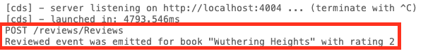

    In the terminal of the bookstore you see the following output:

    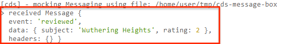

### PART D: Expose entities of the external reviews service

We are now going to expose a new entity **Reviews** from the bookstore. Requests to this entity will trigger an http request to the OData interface of the reviews service.

First, in the bookstore we need to declare the reviews service as an OData service.

1. Now, we'll extend the bookstore app with a new entity **Reviews**. 

   From the **bookstore** project folder, go to the **srv** folder and open the `services.cds` file.

    Replace

    ```swift
    using { sap.capire.reviews.ReviewsService } from 'reviews-service';
    ```

    with

    ```swift
    using { sap.capire.reviews.ReviewsService as external} from 'reviews-service';

    extend service CatalogService {
      @readonly entity Reviews @(cds.persistence.skip) as projection on external.Reviews;
    }
    ```

2. In the `services.js` file add the following code at the end of the file before the closing `}` bracket:

    ```js
    // delegate requests to reviews service
    srv.on('READ', 'Reviews', async (req) => {
      const { Reviews } = reviews_srv.entities

      const tx = reviews_srv.transaction(req)
      const results = await tx.read(Reviews)

      return results
    })
    ```
    
   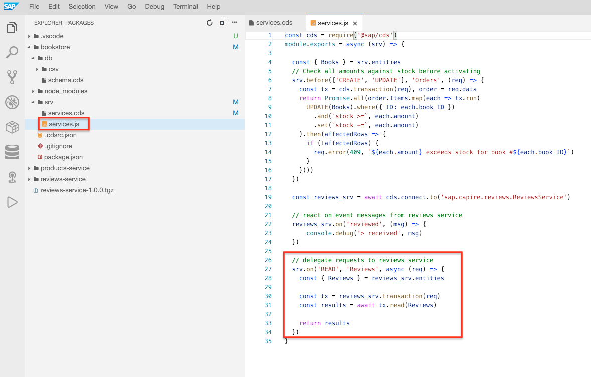


    In this custom handler, we're reading the reviews from the reviews service for every read request of reviews in the bookstore.

3. To restart the bookstore:

   a. Execute `Ctrl + C` in the terminal where the bookstore is running:
   
   b. Run `PORT=4005 cds run bookstore --in-memory`.

4. When prompted, choose **Open in New Tab**.

   You can also reopen the browser window with the landing page of the bookstore.

    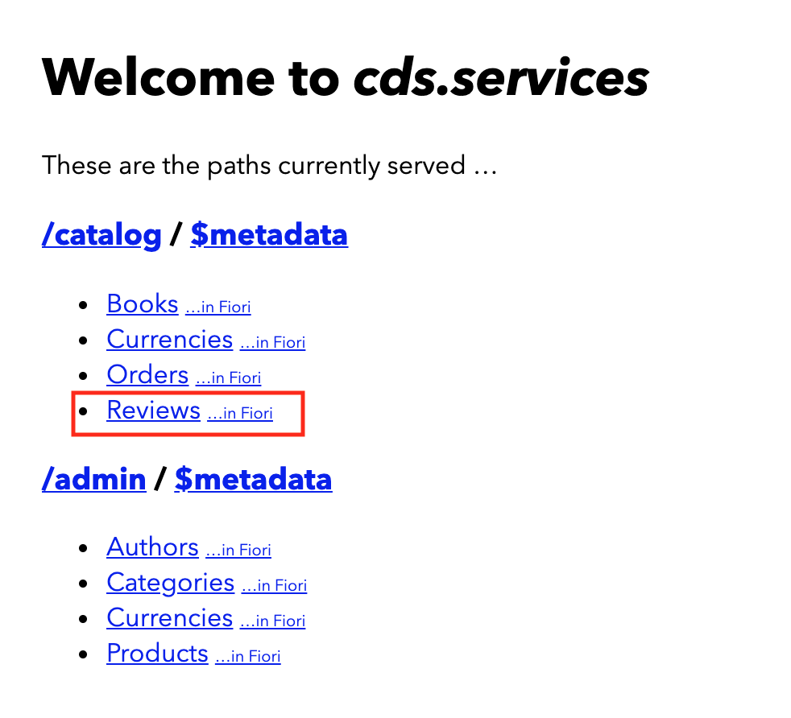  

    If you click on **Reviews** you will see the *'Great book!'* review we just created in [Part C, Step 3e](./README.md#part-c-consume-events-of-an-external-service).

### Congratulations!

You now combined different microservices to talk to each other via synchronous and asynchronous APIs. In [Exercise 4](../exercise04/README.md) you will add a UI for the bookstore application using SAP Fiori Elements.
