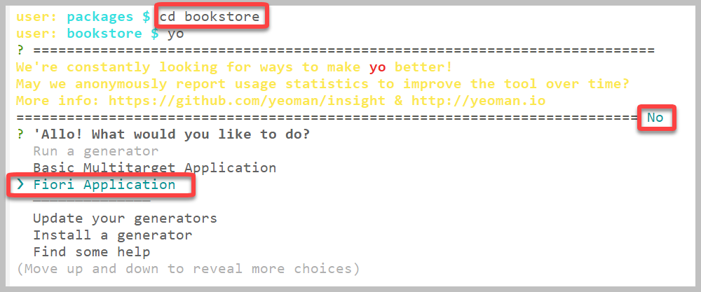
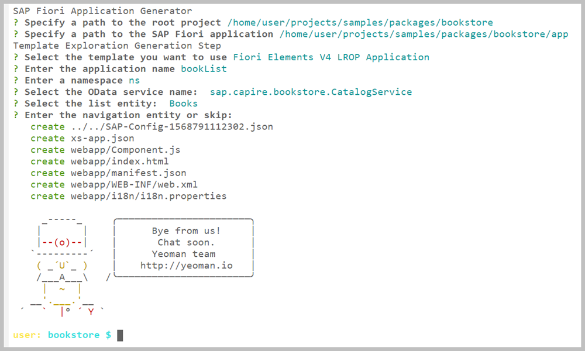
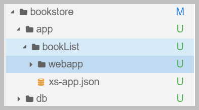
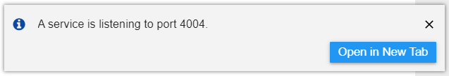
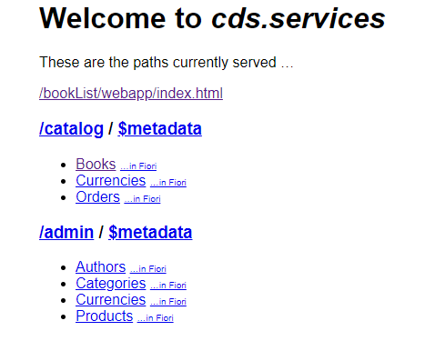
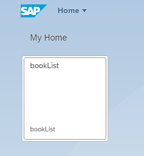
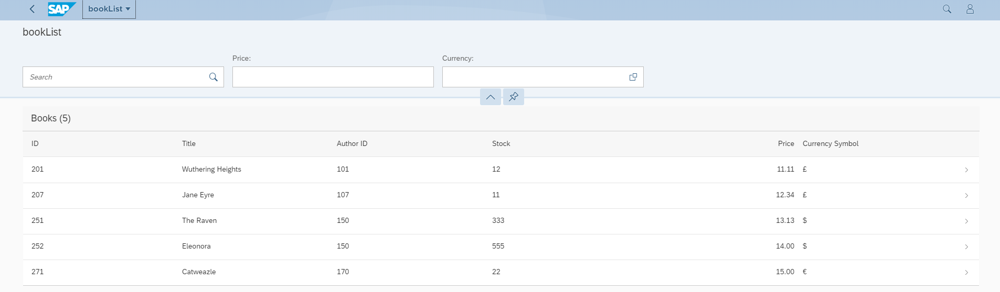

# Exercise 4: Add a UI for the Bookstore Application

## Estimated time: 10 min

## Objective

In this exercise, you'll be using SAP Fiori Elements to create a UI for the catalog service that is exposed in the Bookstore application. The catalog service is exposed as an OData V4 service and we will create a List Report application on top of it, and then run it locally.

## Notes

For all exercises please make sure to use **Google Chrome**. If you haven't completed [Exercise 3](../exercise03/README.md), simply clone [this branch](https://github.com/SAP-samples/cloud-cap-samples/tree/CAA265-node-ex3-final) and immediately continue with Exercise 4.

## Content

- [Part A:  Create the UI app](./README.md#part-a-create-the-ui-app)
- [Part B: Configure the SAP Fiori elements](./README.md#part-b-configure-the-SAP-Fiori-elements)
- [Part C: Run the Bookstore UI app](./README.md#part-c-run-the-Bookstore-UI-app)

## Exercise description

### Part A: Create the UI app

1. Stop all running services in their respective terminals with `CTRL + C`.  

2. Open a new terminal with **Terminal -> New Terminal**.

3. Go to the root of your **bookstore** project with `cd bookstore`.
   
4. To create the UI application, we'll be using the Yeoman tool. Yeoman provides a simple CLI for project generators that helps you kickstart new projects by answering a few quesions.

   a. To initialize Yeoman, in the terminal run the following command:
 
      ```
      yo
      ```
      
   b. Choose **n** in the question presented. It's a generic yo question to give permission to report your usage, and it is not relevant for this exercise.  
   
   c. Choose **Fiori Application** using the keyboard arrows keys and press enter.

      

5.	To define your SAP Fiori applicaton, you'll answer the following questions.

     >At the end of this step, you have a screenshot of all the answers. 
     
     | Question  | Answer |
     | ------------- | ------------- |
     | **Specify a path to the root project?**  | Press **ENTER** to choose the path to **bookstore** as proposed by default.   |
     | **Specify a path to the fiori application?**  | Press **ENTER** to choose the path to the **app** folder as proposed by default.  |
     | **Select the template you want to use** | Choose **Fiori Elements List Report OData V4 application**. This is the application type we want to create. |
     | **Enter application name**  | Add **bookList**. |
     | **Enter namespace** |  Press **ENTER** to choose **ns** as proposed by default. |
     | **Select the OData service name** | Choose **CatalogService** from the list. This is the service that we'll consume in our SAP Fiori application. |
     | **Select the list entity** | Choose **Books** from the list. The **Books** entity is the entity that we'll present in the UI List. |
     |  **Enter the navigation entity or skip**. | Press **ENTER**. |
      
   Your terminal should look like this:
      
   
  
   A new SAP Fiori application **bookList** was created under the **app** folder of your bookstore project.
      
   
   
### Part B: Configure the SAP Fiori elements
  
1. Locate the **app** folder of the **Bookstore** project. 

   a. Right-click the **app** folder and choose **New File**.
   
   b. Call it `booksAnnotation.cds`.

2. In your newly created file, add the following content:
   
  ```swift
   using sap.capire.bookstore.CatalogService as CatalogService  from '../srv/services';

   ////////////////////////////////////////////////////////////////////////////
   //
   //	Books Lists
   //
   annotate CatalogService.Books with @(
      UI: {
           HeaderFacets: [
            {$Type: 'UI.ReferenceFacet', Label: 'Description', Target: '@UI.FieldGroup#Descr'},
         ],
         Facets: [
            {$Type: 'UI.ReferenceFacet', Label: 'Details', Target: '@UI.FieldGroup#Price'},
         ],
         FieldGroup#Descr: {
            Data: [
               {Value: descr},
            ]
         },
         FieldGroup#Price: {
            Data: [
               {Value: price},
               {Value: currency.symbol, Label: 'Currency'},
            ]
         },
         Identification: [{Value:title}],
        SelectionFields: [ ID,  price, currency_code ],
         LineItem: [
            {Value: ID},
            {Value: title},
            {Value: author_ID, Label:'Author ID'},
            {Value: stock},
            {Value: price},
            {Value: currency.symbol, Label:''},
         ]
      }

   );

   ////////////////////////////////////////////////////////////////////////////
   //
   //	Books Details
   //
   annotate CatalogService.Books with @(
      UI: {
      HeaderInfo: {
         TypeName: 'Book',
         TypeNamePlural: 'Books',
         Title: {Value: title},

      },
      }
   );

   ////////////////////////////////////////////////////////////////////////////
   //
   //	Books Elements
   //
   annotate CatalogService.Books with {
      ID @title:'ID' @UI.HiddenFilter;
      title @title:'Title';
      author @title:'Author ID';
      price @title:'Price';
      stock @title:'Stock';
      descr @UI.MultiLineText;
   }

   ```
      
### Part C: Run the Bookstore UI app

1. In the terminal, execute `cds run --in-memory`
      
2. When prompted, choose **Open in New Tab**.

   
         
3. The service opens in a new browser tab.
      
   
         
4. Click on `/bookList/webapp/index.html`. 

   A new tab opens with a sandbox launchpad. You should see your app tile.

   
         
5. Click on the tile to open your bookList application and view your catalog service data.

   

## Well done!
   
You have successfully created a List report OData V4 application consuming data from the catalog service in your Bookstore application. In [Exercise 5](../exercise05/README.md) you will create an S/4 extension with SAP Cloud Application Programming Model and SAP Cloud SDK.
